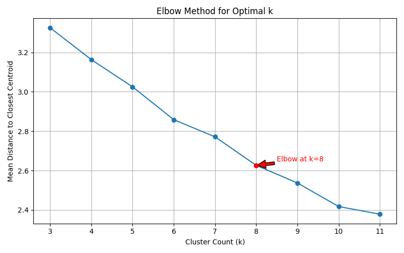
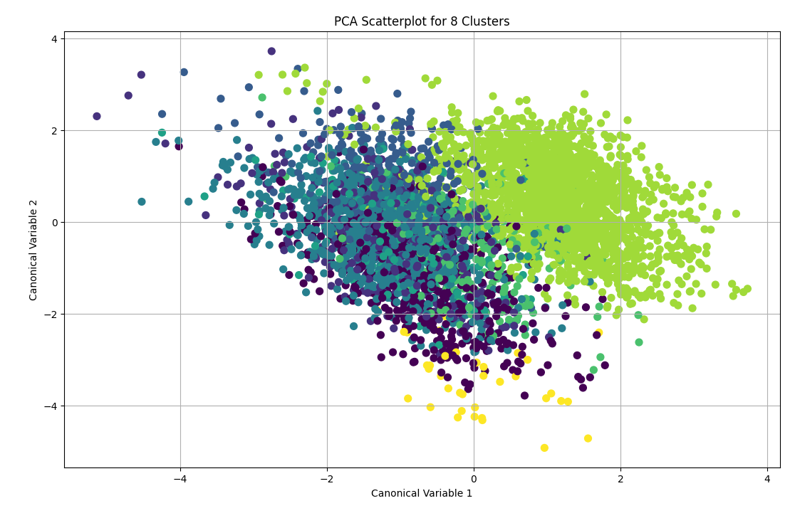

# Introduction
TODO

# [Pre-Cleaning Process](cleaning_process.md)
The process by which values from the developer survey were organized into features, and discussion of the features themselves. 4803 records were left after cleaning.

# Final Cleaning Steps
To reduce bias in clustering, StandardScalar normalization was used on features before running them through the K-Means process.

# Results

Figure 1. Change in mean distance to cluster centroid amongst clustered p-dimensional data points

Figure 2. Clusters scatter plotted on two canonical variables (variables with greatest and second greatest TODO)

TODO