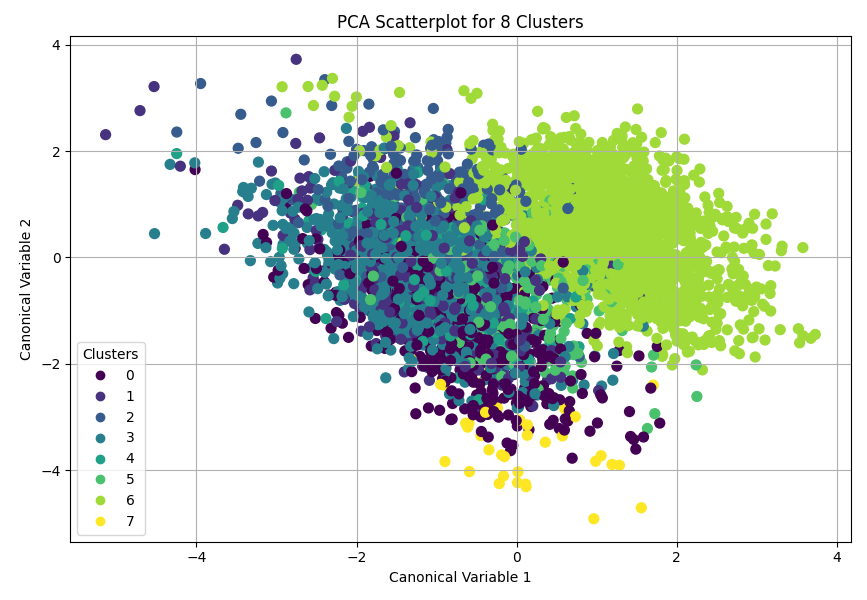

# Introduction
A K-means cluster analysis was conducted on Stack Overflow's 2024 software developer survey results to identify characteristics that affect developers' opinion on the threat of generative AI on their careers. Clustering variables included binary variables (one-hot encoding) of career type, ordinal variables for education level and organization size, and years spent coding non-professionally was included quantitatively. See [Pre-Cleaning Process](cleaning_process.md) and [source code](kmeans-cluster_so2024dev_survey.py) for details.

Data was not split into training / testing sets as validation through testing was not necessary for the purpose of creating clusters. All cleaned records were used in k-means cluster analyses with 3-11 (`create_optimal_kmeans_cluster_model(3, 12)`) clusters using Euclidean distance. K was optimized using the elbow curve method, automatically found using the second derivative of mean distance to cluster centroid per cluster count (see figure 1).

Figure 1. Change in mean distance to cluster centroid amongst clustered p-dimensional data points

Plotted, it may appear that the sharpest drop in variance reduction came at k=10. The second derivative of this curve (change in the rate of change) shows that k=8 has the sharpest drop.

Canonical discriminant analysis was used to reduce the clustering variables down to two variables that account for the the majority of variance amongst clustering variables. A scatterplot of the first two canonical variables by cluster (see figure 2) indicates distinctness amongst clusters 6 (execs + front end), 7 (academia), and to a lesser extent 0 (native). The overlap seen in other clusters indicates similar working environments for the remaining career types.

Figure 2. Clusters scatter plotted on two canonical variables

# [Pre-Cleaning Process](cleaning_process.md)
The process by which values from the developer survey were organized into features, and discussion of the features themselves. 4803 records were left after cleaning.

# Final Cleaning Steps
To reduce bias in clustering, StandardScalar normalization was used on features before running them through the K-Means process.

# Results
Mean values found within each cluster produced the table below.
See [the full annotated XLSX](cluster-results.xlsx) for details.

| Cluster# | Types            | Traits                                                                                  |
|----------|------------------|-----------------------------------------------------------------------------------------|
| 0        | Native           |                                                                                         |
| 1        | DataScienceAndAI | High edu                                                                                |
| 2        | Managers         | High pay, high age,   high AI opinion                                                   |
| 3        | BackEnd          |                                                                                         |
| 4        | DevSupport       | Low AI opinion, big   org                                                               |
| 5        | FullStack        | High AI threat, low   edu, high remote work, short history of coding                    |
| 6        | Execs, FrontEnd  | Small org                                                                               |
| 7        | Academia         | Low pay, low age, low   AI threat, highest edu, low remote work, long history of coding |

We find that the group which views generative AI as the highest threat to be full stack developers (cluster 5), who also showed the lowest education amount, highest degrees of remote work, and shortest history of coding nonprofessionally.

The group that least viewed generative AI as a threat to their jobs were those in academia (cluster 7), who were also shown to have the highest mean education level and longest history of coding nonprofessionally.