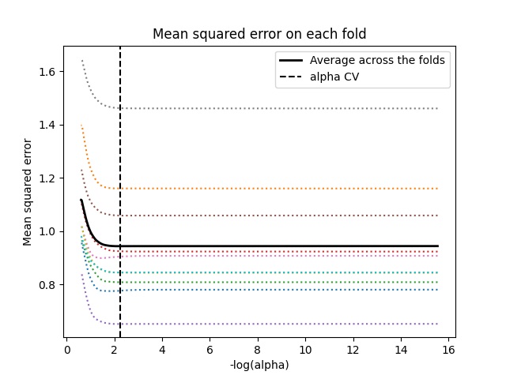
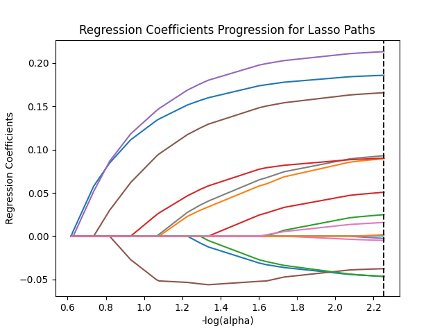

# Introduction
A lasso regression analysis was conducted upon survey results from the 2024 StackOverflow developer survey of developer salaries, history, and many other traits.
The goal of this analysis was to find a subset amongst 19 "features" that could be used to predict the scalar of a developer's salary in comparison to their home country's GNI per capita.

## Why try to predict `salary / GNI per capita`?
An initial conceipt of this analysys is that features might be able to predict how "well paid" a developer is in US dollars.
However, because the survey responses come from developers from all over the world, salary as a simple consistent currency would be heavily influenced by the currency's exchange rate into USD. On that subject, we conceive GNI per capita, or the average salary of individuals living in a particular country, to form a "fairly paid" amount for developers in a country. We will refer to this concept as **"pay level"** from here on.

As discussed in the results section, the pay level idea turned out to be far too naive a measure for accurate predictions throughout the world.

# [Pre-Cleaning Process](cleaning_process.md)
The process by which values from the developer survey were organized into features, and discussion of the features themselves.

# Final Cleaning Steps
It turned out that with too much variation in GNI per capita, the final "percentage of GNI per capita" pay level could not be reliably predicted. A discussion of why this is the case is outside the scope of this analysis, but we may assume that the level of pay developers recieve in any given country can be swayed from everything from local culture to business demands.

The final step taken to get *some* insights out of the dataset was to filter out records from countries with GNI per capita beneath 80000 USD. This left behind repsonses from four countries. It should be noted that most survey responses came from the USA.
```
Countries used: ['united states' 'switzerland' 'luxembourg' 'norway']
```

This left behind 4836 usable records. For processing with LASSO, to remove any bias amongst features, a pipeline with StandardScalar normalization was used.

# Results

Records were randomly split into 70%/30% training / prediction sets. The "LASSO" least angle regression algorithm with k=10 fold validation was used to estimate the model for the training set, and the model was validated using the test set. The change in the cross validation average squared error at each setp was used to identify the best subset of predictor features.

Figure 1. Change in the validation mean square error at each step


Of the 18 predictor features, 16 were shown to have some level of influence on the predicted salary vs. GNI per capita scalar.

## Negative Correlations
Some features were shown to have a negative association with pay level. It comes as no surprise that careers in academia had the strongest negative association (-0.067). Sentiment regarding generative AI as a threat to job safety also had a negative association (-0.065), perhaps due to a recognition on the part of developers that their lower-paying job was in danger of being automated.

## Positive Correlations
Organization size had the largest positive pay level (0.25). In other words, the larger the organization, the greater the pay-- not a big surprise for the large corporations of high GNI per capita countries. Surprisingly, the ability to work remotely also saw higher pay amounts, although there may be correlation between remote work and organization size. The highest correlation between developer career type and pay was management (0.12), even moreso than executive management (0.01). Perhaps C-suite executives that can call themselves developers aren't so specialized as to lead major corporations.

## Final Remarks
Given the massive mean-squared error for predictions, we can safely say that the precise percentage of pay vs. GNI per capita is not something that can be easily predicted merely through semi-arbitrary job classifications or even education level.


```
DEVTYPE_Academia coefficient:                -0.06691434990118693
ai_threat coefficient:                       -0.06463038696524914
DEVTYPE_FrontEnd coefficient:                -0.05622452289791265
DEVTYPE_ResearchAndDevelopment coefficient:  -0.012997519363360407
DEVTYPE_FullStack coefficient:               -0.003099858376386884
DEVTYPE_BackEnd coefficient:                 0.0
DEVTYPE_DataScienceAndAI coefficient:        0.0
DEVTYPE_Native coefficient:                  0.0
ai_sent coefficient:                         0.0
DEVTYPE_DevSupport coefficient:              0.004999977439941789
DEVTYPE_ExecutiveManagement coefficient:     0.010195767301909997
years_code_pre_pro coefficient:              0.02607892809066332
DEVTYPE_Backend coefficient:                 0.05862826009637903
ed_level coefficient:                        0.11003689980175213
DEVTYPE_Management coefficient:              0.12030640336785677
age coefficient:                             0.1581853662061485
remote_work coefficient:                     0.16286890071329924
org_size coefficient:                        0.252923502086601
training data MSE: 1.3193013369582782
test data MSE: 47023.65050902283
training data R-square: 0.13833218698537886
test data R-square: -0.0007538456393298976
```